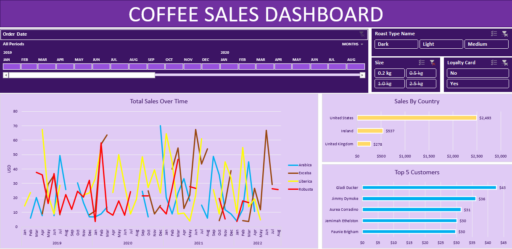

# Coffee Sales Dashboard using Excel

## Project Overview

This project is an interactive **Coffee Sales Dashboard** created entirely in **Microsoft Excel**.
The dashboard helps analyze coffee sales performance across different countries, customers, roast types, product sizes, and time periods.

The goal of this project is to transform raw sales data into meaningful business insights using Excel tools such as:

* Pivot Tables
* Pivot Charts
* Slicers
* Timelines
* Conditional Formatting
* Data Cleaning Techniques
* Dashboard Design

---

# Dashboard Preview

The dashboard contains multiple interactive sections:

### 1. Total Sales Over Time

* Displays monthly sales trends
* Compares different coffee types:

  * Arabica
  * Excelsa
  * Liberica
  * Robusta

### 2. Sales by Country

Shows total sales contribution from:

* United States
* Ireland
* United Kingdom

### 3. Top 5 Customers

Displays highest revenue-generating customers.

### 4. Interactive Filters (Slicers)

Users can filter data using:

* Roast Type

  * Dark
  * Light
  * Medium
* Coffee Size

  * 0.2 kg
  * 0.5 kg
  * 1.0 kg
  * 2.5 kg
* Loyalty Card

  * Yes
  * No

### 5. Timeline Filter

Used to analyze sales data by:

* Year
* Month
* Specific periods

---

# Tools & Technologies Used

| Tool            | Purpose                            |
| --------------- | ---------------------------------- |
| Microsoft Excel | Data Analysis & Dashboard Creation |
| Pivot Tables    | Data Summarization                 |
| Pivot Charts    | Visual Representation              |
| Slicers         | Interactive Filtering              |
| Timeline        | Date Filtering                     |
| Excel Formulas  | Data Processing                    |

---

# Dataset Information

The project contains multiple sheets:

| Sheet Name      | Description                 |
| --------------- | --------------------------- |
| Dashboard       | Final Interactive Dashboard |
| TotalSales      | Sales Analysis              |
| CountryBarChart | Country-wise Sales          |
| Top5Customers   | Customer Analysis           |
| orders          | Raw Order Data              |
| customers       | Customer Information        |
| products        | Product Details             |

---

# Features of the Dashboard

* Fully interactive dashboard
* Dynamic filtering using slicers
* Timeline-based analysis
* Clean and professional UI
* Easy-to-understand charts
* Business performance tracking
* Customer and country analysis

---

# Steps Followed in the Project

## 1. Data Collection

Imported and organized:

* Orders data
* Customer data
* Product data

---

## 2. Data Cleaning

Performed:

* Removed duplicates
* Handled missing values
* Corrected formatting
* Standardized columns

---

## 3. Data Processing

Used formulas like:

* XLOOKUP / VLOOKUP
* INDEX & MATCH
* IF Statements
* SUMIFS
* COUNTIFS

---

## 4. Pivot Table Creation

Created pivot tables for:

* Sales trends
* Country analysis
* Customer analysis
* Product performance

---

## 5. Chart Creation

Created:

* Line Charts
* Bar Charts
* KPI Visualizations

---

## 6. Dashboard Development

Combined:

* Charts
* Pivot tables
* Slicers
* Timeline filters

into a single interactive dashboard.

---

# Business Insights Generated

* United States generated the highest sales.
* Arabica coffee showed strong performance.
* Loyalty card customers contributed significantly to revenue.
* Certain customers consistently generated high sales.
* Seasonal sales trends were identified using timeline analysis.

---

# Learning Outcomes

Through this project, I learned:

* Excel dashboard design
* Data visualization
* Business analysis
* Interactive reporting
* Data cleaning techniques
* Pivot table optimization

---

# Conclusion

This Coffee Sales Dashboard demonstrates how Excel can be used as a powerful business intelligence tool for:

* Sales tracking
* Customer analysis
* Product performance monitoring
* Interactive reporting

The project showcases strong skills in:

* Excel
* Data Analysis
* Dashboard Development

